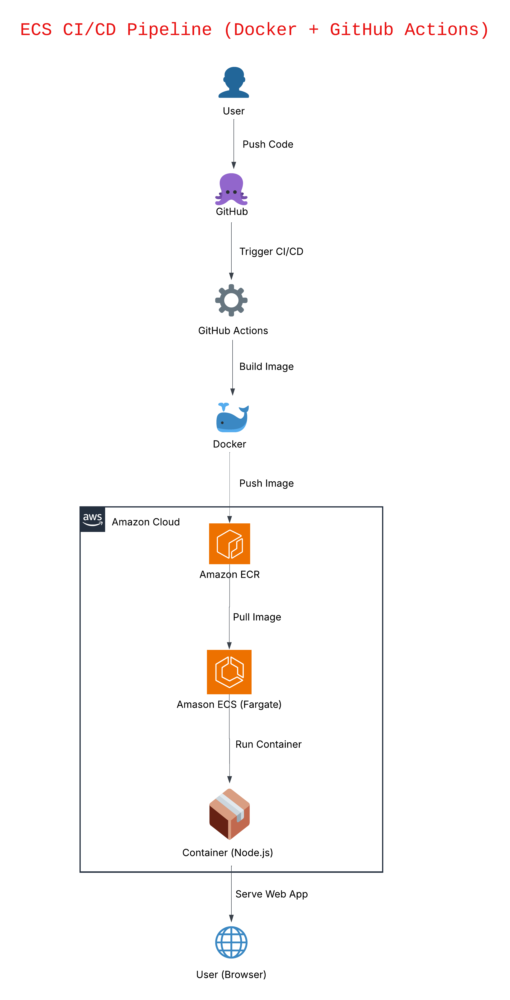
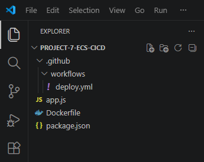
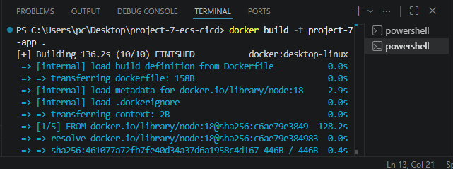
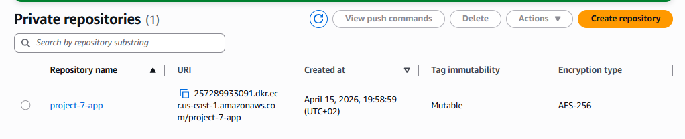
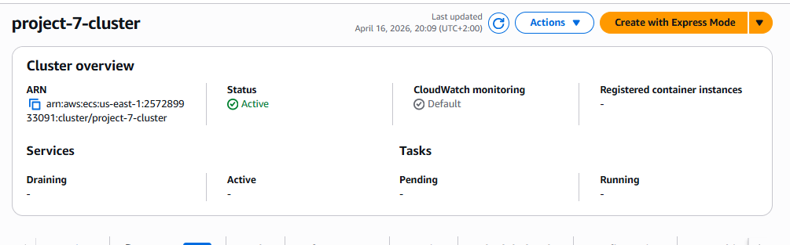
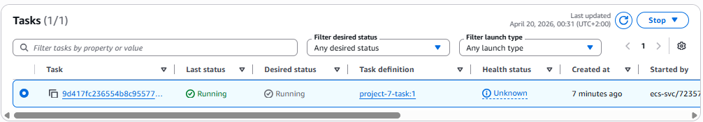
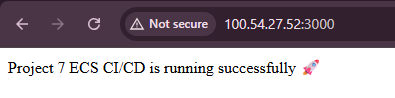

# 🚀 Project 7 - ECS CI/CD Deployment

## 📌 Overview
In this project I created a web application and deployed it on AWS using Docker, ECR, ECS (Fargate) and GitHub Actions.

The goal was to understand the full flow from local development to a real cloud deployment.

---

## 🛠️ Project Setup

I created a folder called:

project-7-ecs-cicd

Inside VS Code I created these files:

- app.js → main logic of the web app (backend)
- package.json → project info, dependencies and start commands
- Dockerfile → instructions to build the container
- .github/workflows/deploy.yml → CI/CD automation

The `.github/workflows` folder is required because GitHub reads automation from there.

The `deploy.yml` file is the brain of the CI/CD pipeline:
when I push code → it builds Docker image → pushes to ECR → deploys to ECS.

---

## ⚙️ Application Logic

- app.js → defines how the app responds to user requests  
- package.json → tells Node.js what to install and how to run the app  

Libraries = ready-to-use code  
Dependencies = libraries used inside the project  

---

## 🔄 CI/CD Flow (Simple Explanation)

1. I modify the app code (app.js)
2. I do `git push`
3. GitHub Actions starts automatically
4. Docker builds the image
5. Image is pushed to AWS ECR
6. ECS takes the image
7. ECS runs the container  
8. Website is online 🚀

---

## 💻 Local Testing

I used VS Code terminal:

- `npm install` → installs dependencies (Express)
- `npm start` → starts the server

Then I opened:

http://localhost:3000

and verified that the app works.

---

## 🛠️ Troubleshooting

I had an issue where PowerShell blocked npm.

So I:
- switched to PowerShell directly
- used `npm.cmd install`
- realized I was in the wrong folder

👉 Important lesson:
Always run commands inside the correct project root folder.

---

## 🐳 Docker

I built the image with:

docker build -t project-7-app .

Then checked:

docker images

Then I tested locally:

docker run -d -p 3000:3000 --name project-7-container project-7-app

The container worked correctly on:

http://localhost:3000

👉 I learned:
Docker can both build AND run containers locally for testing.

---

## ☁️ AWS ECR

I created a repository:

project-7-app

Installed AWS CLI and configured it:

aws configure

Then connected Docker to ECR:

docker login (with AWS command)

Then:

docker tag → connect local image to ECR  
docker push → upload image  

---

## ☁️ AWS ECS

Created:

- Cluster → project-7-cluster
- Task Definition → project-7-task
- Launch type → Fargate
- CPU → 0.5 vCPU
- Memory → 1 GB
- Container → project-7-container
- Port → 3000

---

## 🚀 Deployment (Service)

Created Service with:

- Task → project-7-task
- Desired tasks → 1
- Public IP → enabled
- Default VPC and subnets

---

## 🔧 Final Issue (Important)

The app was NOT opening at first.

Problem:
Security Group blocked port 3000.

Solution:
Added inbound rule:

Port 3000 → 0.0.0.0/0

After that:

✅ Website worked successfully

---
## 🏗️ Architecture and Diagram

User → ECS (Fargate) → Container  
ECR → provides the container image

---

## 📸 Screenshots

### Project Structure

### Docker Build

### ECR Repository

### ECS Cluster

### Task Running

### Application Live

---

## 🌐 Live Deployment

The application was successfully deployed on AWS ECS.

After testing, resources were stopped to avoid extra costs.

---

## 💡 What I Learned

- Docker containerization
- CI/CD basics with GitHub Actions
- AWS ECR and ECS workflow
- Debugging real cloud issues
- Importance of Security Groups

---

## 👨‍💻 Author
Muhammad Mohib
